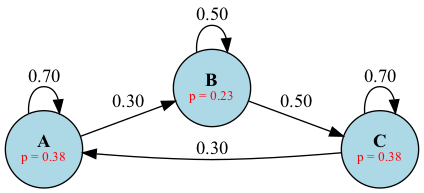

# MarkovViz

A Python library for implementing and visualizing Markov models with a focus on reinforcement learning.

## Features

- **Multiple Input Formats**: Support for NumPy arrays, Pandas DataFrames, Python dictionaries, and lists
- **Markov Chain Implementation**: Calculate state convergence with customizable iterations and thresholds
- **Markov Reward Process**: Evaluate state values using linear equations or dynamic programming
- **Visualization**: Generate clear graphical representations of:
  - State transition probabilities
  - State distributions
  - Rewards and state values
  - Combined views for reinforcement learning analysis

## Quick Start

### Basic Markov Chain

```python
import numpy as np
from markov import MarkovChain, PlotMarkov

# Define transition matrix
transitions = np.array([
    [0.7, 0.3, 0.0],
    [0.0, 0.5, 0.5],
    [0.3, 0.0, 0.7]
])

# Create MarkovChain instance
mc = MarkovChain(transitions, node_names=['A', 'B', 'C'])

# Set initial state probabilities
initial_state = {'A': 1.0, 'B': 0.0, 'C': 0.0}  # Start from state A
# Or using array: initial_state = [1.0, 0.0, 0.0]

# Calculate convergence
final_state = mc.converge_markov_chain(
    initial_state=initial_state,
    max_iterations=1000,
    threshold=1e-6,
    verbose=True
)
print("Converged state probabilities:", final_state)
# Example output:
# Iteration 1: [0.7  0.15 0.15]
# Iteration 2: [0.49 0.36 0.15]
# ...
# Converged in 21 iterations.
# Converged state probabilities: [0.38461615 0.23076912 0.38461473]

# Visualize with final probabilities
mc.set_probs(final_state)
plot = PlotMarkov(mc)
graph = plot.draw_graph_with_probs()
graph.render('markov_chain_converged', view=True, format='png')
```


### Markov Reward Process - State Value Evaluation

```python
from markov import MarkovRewardProcess

# Define a simple grid world:
# [Start] <-> [Left]  --> [End]
#    ^          ^           ^
#    |          |           |
#    v          |           |
# [Right] ----- + ----------+

transitions = {
    'Start': {'Left': 0.4, 'Right': 0.6},
    'Left': {'Start': 0.3, 'End': 0.7},
    'Right': {'Start': 0.2, 'Left': 0.3, 'End': 0.5},
    'End': {'End': 1.0}
}

rewards = {
    'Start': 0,
    'Left': 1,
    'Right': 4,
    'End': 10
}

# Create MRP instance with discount factor
mrp = MarkovRewardProcess(transitions, rewards, gamma=0.9)

# Evaluate using linear equation method
values_linear = mrp.evaluate_by_linear_equation()
print("State values (Linear Equation):", values_linear)
# Example output:
# Start: 85.31, Left: 93.03, Right: 90.77, End: 100.0

# Evaluate using dynamic programming
values_dp = mrp.evaluate_by_DP(threshold=0.001)
print("State values (Dynamic Programming):", values_dp)
# Example output:
# Start: 85.30, Left: 93.02, Right: 90.76, End: 99.99

# Compare results
print("Maximum difference between methods:", 
      max(abs(values_linear - values_dp)))

# Visualize with both rewards and computed values
mrp.set_values(values_linear)  # or values_dp
plot = PlotMarkov(mrp)
graph = plot.draw_graph_with_rewards_and_values()
graph.render('markov_reward_process_evaluated', view=True, format='png')
```


## Class Overview

### Markov (Base Class)
- Handles different input formats for transition matrices
- Provides basic data structure and validation

### MarkovChain
- Implements basic Markov Chain functionality
- Supports state probability convergence analysis
- Calculates steady-state probabilities

### MarkovRewardProcess
- Implements Markov Reward Process calculations
- Supports both linear equation and dynamic programming approaches
- Calculates state values with configurable discount factor

### PlotMarkov
- Generates graphical visualizations using Graphviz
- Supports multiple visualization modes:
  - Basic state transitions
  - State probabilities
  - Rewards
  - State values
  - Combined views

## Requirements

- Python 3.7+
- NumPy
- Pandas
- Graphviz

## Contributing

Contributions are welcome! Please feel free to submit a Pull Request.

## License

This project is licensed under the MIT License - see the LICENSE file for details.

## Citation

If you use this library in your research, please cite:

```bibtex
@software{markovviz2024,
  title = {MarkovViz: A Python Library for Markov Models and Reinforcement Learning Visualization},
  year = {2024},
}
```
